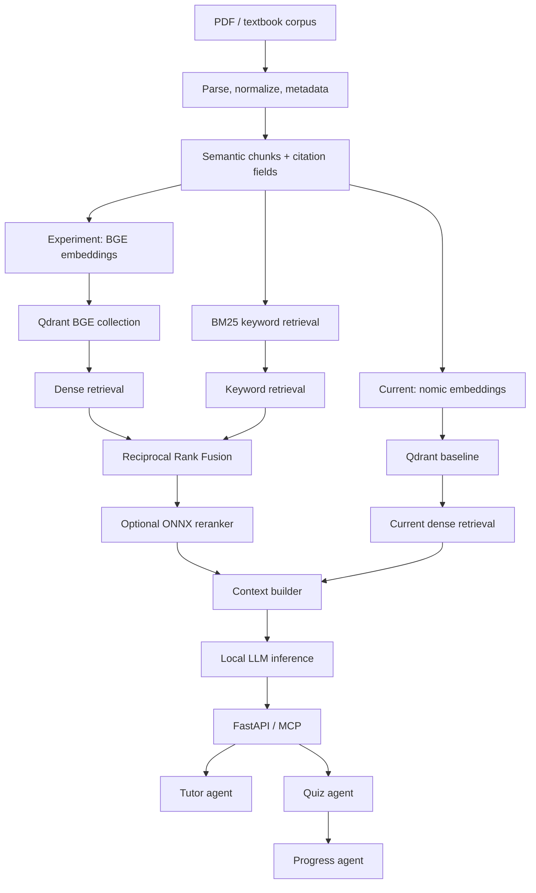

# Architecture and implementation status

## Verified current system

```text
MATLAB textbook PDF
  -> extract_pdf.py -> extracted_text.txt -> chunk_pdf.py
  -> chunks.json with chapter/page/problem metadata
  -> ingest.py using Ollama nomic-embed-text
  -> Qdrant collection: journey_textbook
  -> query.py retrieval -> Ollama llama3.2 grounded answer
  -> FastAPI /ask and /learn, plus FastMCP tools
```

## Target platform flow



## Component status

| Capability | Status | Notes |
| --- | --- | --- |
| PDF processing and citation metadata | Implemented | Local MATLAB corpus pipeline. |
| Qdrant + nomic dense retrieval | Implemented | Current `journey_textbook` baseline. |
| BGE collection builder | Implemented | Creates separate `journey_textbook_bge_v1`. |
| BM25 and Reciprocal Rank Fusion | Implemented utilities | Use evaluation before defaulting to hybrid search. |
| ONNX reranking | Implemented optional adapter | Needs a local exported model. |
| Quiz and progress workflow | Implemented | Local/in-memory sessions only. |
| LangGraph agents | Planned | Add after retrieval experiments are measured. |
| FAISS, Milvus, pgvector | Planned | Benchmark adapters, not current capability. |
| Qwen, Granite, Mistral comparison | Planned | Requires licensed model and hardware tests. |
| llama.cpp, vLLM, SGLang | Planned | Serving choice depends on benchmark results. |
| LoRA/QLoRA, MLflow, DeepEval | Planned | Need curated data and governance. |
| Microsoft 365 connector | Planned | Requires Entra/MSAL/OAuth authorization. |
