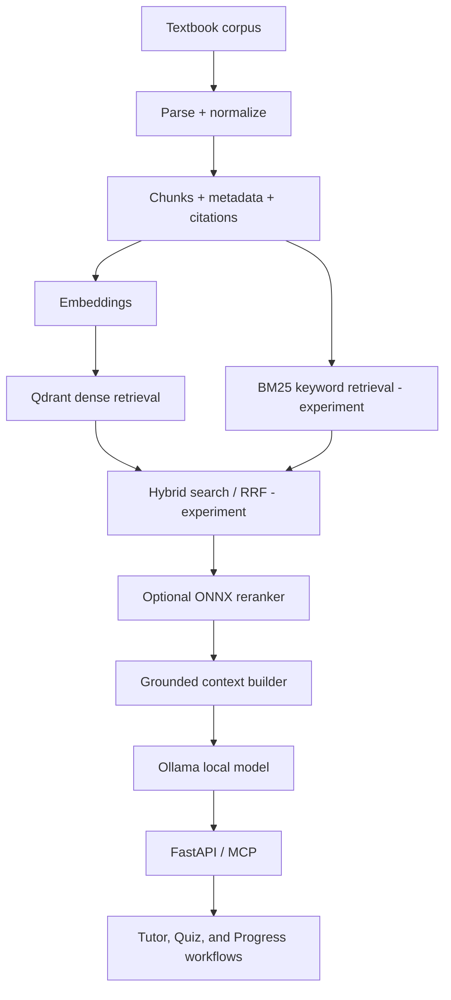

# Journey Intelligent Textbook / Agentic Learning Platform

AI-powered Retrieval-Augmented Generation pipeline for the Journey adaptive textbook platform (CS-ERG, Michigan Tech).

> **Current status:** the runnable baseline uses PDF extraction, textbook chunks,
> Ollama `nomic-embed-text`, Qdrant, Ollama `llama3.2`, FastAPI, and MCP. BGE
> indexing, BM25, Reciprocal Rank Fusion, offline evaluation, and ONNX reranking
> are implemented as experimental components. LangGraph, vLLM, SGLang, FAISS /
> Milvus adapters, fine-tuning, MLflow, DeepEval, and Microsoft 365 connectors
> are planned—not presented as completed features.

## Platform flow



Current baseline: `Corpus -> chunks -> nomic embeddings -> Qdrant -> Ollama -> cited answer`.

See [ARCHITECTURE.md](ARCHITECTURE.md) for implemented-versus-planned status,
[DATASET.md](DATASET.md) for corpus and citation details, and
[RETRIEVAL_ENGINEERING.md](RETRIEVAL_ENGINEERING.md) for BGE/BM25/RRF evaluation.

## Stack
- **PDF extraction:** pdfplumber
- **Vector database:** Qdrant (Docker)
- **Embeddings:** Ollama + nomic-embed-text
- **LLM:** Ollama + llama3.2
- **RAG:** custom Qdrant retrieval, citation building, and optional retrieval experiments
- **API:** FastAPI + uvicorn
- **MCP:** FastMCP, wrapping the existing Journey retrieval and answer functions

## Setup

1. Install dependencies in a virtual environment:

```powershell
py -3.11 -m venv venv
.\venv\Scripts\python.exe -m pip install -r requirements.txt
```

2. Start Qdrant at `http://localhost:6333` and Ollama. Make sure these models are available:

```powershell
ollama pull nomic-embed-text
ollama pull llama3.2
```

3. Start the existing HTTP API:

```powershell
.\venv\Scripts\python.exe -m uvicorn main:app --reload
```

4. Start the MCP server in a separate terminal:

```powershell
.\venv\Scripts\python.exe mcp_server.py
```

The MCP endpoint is `http://127.0.0.1:8001/mcp`. It is read-only and uses the existing `journey_textbook` Qdrant collection; it does not reprocess or duplicate textbook vectors.

## BGE retrieval experiment

The existing `journey_textbook` collection is preserved. Build a separate BGE
collection only when you are ready to run a local experiment:

```powershell
.\venv\Scripts\python.exe bge_ingest.py
```

This creates `journey_textbook_bge_v1`; it does not overwrite the baseline.
Read [ONNX_RERANKING.md](ONNX_RERANKING.md) before enabling a cross-encoder.

## Project screenshots

### End-to-end architecture


### Qdrant running in Docker


### FastAPI RAG question and cited answer


### Local Ollama models


### MCP server implementation


