# Journey Intelligent Textbook / Agentic Learning Platform

Local Retrieval-Augmented Generation pipeline for the Journey adaptive textbook platform (CS-ERG, Michigan Tech). It retrieves MATLAB textbook chunks from Qdrant, builds a cited context, and asks a local Ollama model for an answer.

The same baseline is available through FastAPI and a local MCP server. Separate modules provide unconnected BGE, BM25, RRF, evaluation, and ONNX reranking experiments.

> **Current status:** the runnable baseline uses PDF extraction, textbook chunks,
> Ollama `nomic-embed-text`, Qdrant, Ollama `llama3.2`, FastAPI, and MCP. BGE
> indexing, BM25, Reciprocal Rank Fusion, offline evaluation, and ONNX reranking
> are implemented as experimental components. LangGraph, vLLM, SGLang, FAISS /
> Milvus adapters, fine-tuning, MLflow, DeepEval, and Microsoft 365 connectors
> are planned—not presented as completed features.

Status: **in development**. The baseline is runnable locally. Retrieval experiments are separate from the default request path.

---

## Repository structure

```text
.
├── main.py                    # FastAPI application and HTTP routes
├── query.py                   # Baseline Qdrant retrieval and Ollama answer generation
├── learning.py                # Structured explanation and quiz generation
├── progress.py                # Deterministic quiz score routing
├── sessions.py                # Process-local quiz session store
├── guardrails.py              # Question, citation, and local rate-limit checks
├── mcp_server.py              # Streamable HTTP MCP resources and tools
├── extract_pdf.py             # PDF to page text and extracted_text.txt
├── chunk_pdf.py               # Problem-level chunks and metadata
├── ingest.py                  # Baseline nomic embedding ingestion into Qdrant
├── bge_ingest.py              # Separate BGE collection builder
├── retrieval.py               # BM25 and Reciprocal Rank Fusion utilities
├── hybrid_retrieval.py        # Runnable BGE + BM25 + RRF retrieval mode
├── reranker.py                # Optional ONNX cross-encoder adapter
├── evaluation.py              # Offline retrieval scoring helpers
├── retrieval_metrics.py       # Reciprocal-rank and NDCG functions
├── query_rewrite.py           # Whitespace-normalization baseline
├── chunks.json                # Generated textbook chunk corpus
├── pages.json                 # Generated per-page extracted text
├── extracted_text.txt         # Generated raw extracted text
├── evals/
│   └── retrieval_cases.json   # Three-case seed retrieval evaluation set
├── tests/                     # pytest coverage for deterministic modules
├── assets/screenshots/        # Project screenshots used by this README
├── docs/
│   └── retrieval-experiments.md # Detailed experimental retrieval flows
├── requirements.txt           # Python dependency constraints
├── AGENTS.md                  # Instructions for coding agents
└── CLAUDE.md                  # Points Claude Code to AGENTS.md
```

**Generated corpus files**: `chunks.json`, `pages.json`, and `extracted_text.txt` are present in this checkout. The source PDF used by `extract_pdf.py` is not tracked here.

---

## Corpus extraction and chunking

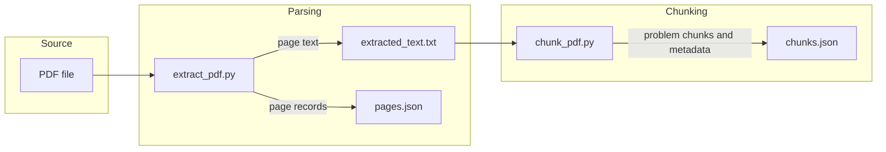

The pipeline uses page markers from `extract_pdf.py`, then splits text at the `Problem chapter-set.number` pattern in `chunk_pdf.py`.

**Metadata**: each chunk includes a problem ID, chapter, topic, set, page number, and source-PDF name. `chunk_pdf.py` assigns page `0` when no preceding page marker exists.

**Status**: **Complete** for the checked-in generated corpus. A clean re-extraction is **Partial** because the hard-coded PDF file is not in this repository.

---

## Baseline ingestion

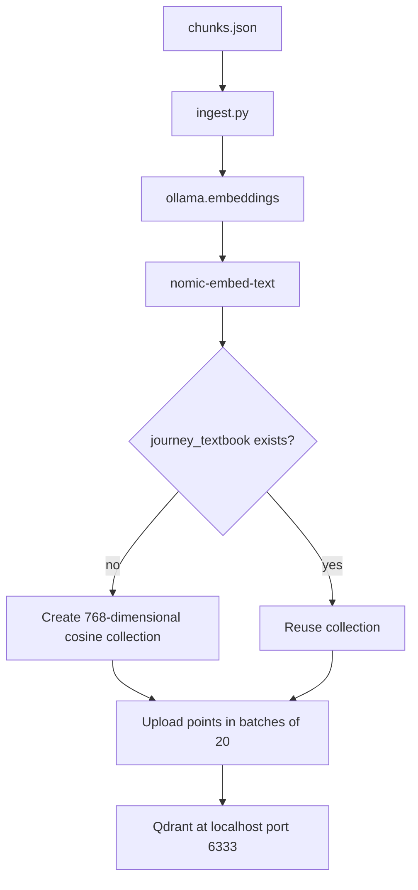

The baseline stores up to 2,000 text characters and citation metadata per Qdrant point. It keeps the current collection name `journey_textbook`.

**Failure handling**: `ingest.py` catches an embedding error per chunk, prints it, and continues. It does not delete existing Qdrant points.

**Status**: **Complete** as a script. It requires a running Qdrant service and an Ollama model named `nomic-embed-text`.

---

## HTTP answer request

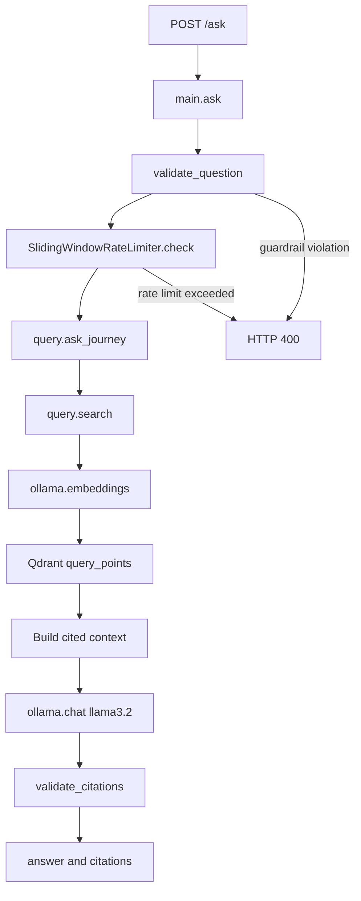

The API validates the learner question before it calls an external service. `query.ask_journey` instructs the model to use only retrieved textbook context.

**Validation**: blank questions, questions longer than 1,000 characters, and a small fixed list of injection phrases are rejected. The in-memory limiter allows 20 requests per client ID per 60 seconds.

**Citation rule**: every response must contain at least one citation with `problem_id` and `page`; otherwise the request returns HTTP 400.

**Status**: **Complete** for local HTTP use. CORS currently allows all origins.

---

## Learning and quiz generation

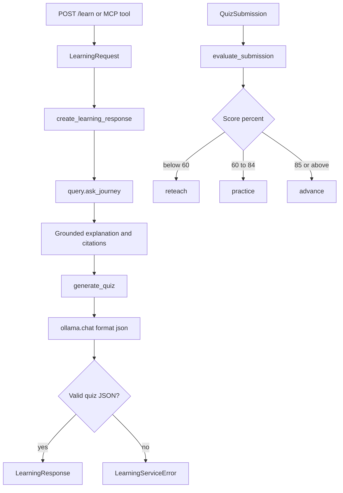

Quiz generation starts from the cited explanation instead of directly from an ungrounded prompt. The learner-facing quiz model excludes answer keys.

**Schema checks**: quiz JSON must contain the requested number of questions, with two to four choices per question. Invalid model JSON raises `LearningServiceError` and `/learn` maps it to HTTP 503.

**Progress**: `progress.py` and `sessions.py` are **Complete** local primitives. The FastAPI app has no submission endpoint or persistent student store, so the end-to-end progress API is **Partial**.

---

## MCP tool request

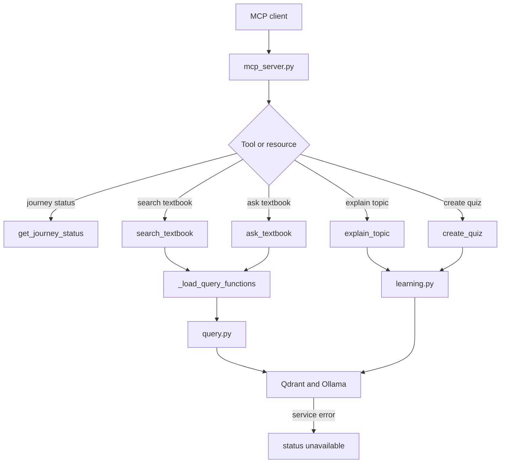

The MCP server binds to `127.0.0.1:8001` and uses Streamable HTTP. Query imports are lazy so unavailable local services are reported in the result instead of preventing MCP startup.

**Limits**: `search_textbook` clamps `top_k` to 1 through 10. Blank questions return `invalid_request`.

**Status**: **Complete** for the listed read-only tools. It does not write to the Qdrant collection or persist learner data.

---

## Experimental retrieval path

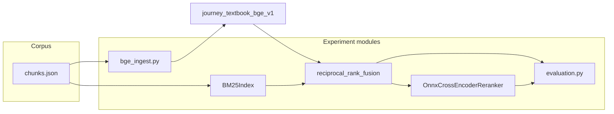

The experimental modules preserve the baseline collection. BGE vectors go to a different Qdrant collection, and BM25/RRF do not currently run inside `query.search`.

**ONNX switch**: `query.search` uses the reranker only when `JOURNEY_ONNX_RERANKER_DIR` is set. It then retrieves at least 10 Qdrant candidates and returns the requested top-k reranked results.

**Evaluation**: `evals/retrieval_cases.json` has three seed cases. `score_rankings` reports Recall@k, MRR, and NDCG@k for supplied rankings. It does not execute a live Qdrant benchmark by itself.

**Status**: BGE builder, BM25, and RRF are **Complete** local components. Set `JOURNEY_RETRIEVAL_MODE=hybrid` before starting FastAPI to use the BGE + BM25 + RRF path. ONNX reranking remains **Partial** because it needs a local exported model. See [docs/retrieval-experiments.md](docs/retrieval-experiments.md) and [RUNTIME_PLAN.md](RUNTIME_PLAN.md).

---

## Build requirements

- Python 3.11. The existing setup instructions use `py -3.11`.
- Ollama, with `nomic-embed-text` and `llama3.2` pulled for the baseline.
- Qdrant reachable at `http://localhost:6333`. The project uses a Docker-hosted Qdrant instance in its setup documentation.
- Optional BGE builder: `sentence-transformers` downloads `BAAI/bge-small-en-v1.5` when first run.
- Optional ONNX reranker: an exported compatible `model.onnx` and `JOURNEY_ONNX_RERANKER_DIR`.

Windows PowerShell setup:

```powershell
py -3.11 -m venv venv
.\venv\Scripts\python.exe -m pip install -r requirements.txt
ollama pull nomic-embed-text
ollama pull llama3.2
```

---

## Building and running

1. Install dependencies in a virtual environment:

```powershell
py -3.11 -m venv venv
.\venv\Scripts\python.exe -m pip install -r requirements.txt
```

2. Start Qdrant at `http://localhost:6333` and Ollama. Make sure these models are available:

```powershell
ollama pull nomic-embed-text
ollama pull llama3.2
```

3. Create or refresh the baseline Qdrant collection from the checked-in chunks:

```powershell
.\venv\Scripts\python.exe ingest.py
```

4. Start the HTTP API:

```powershell
.\venv\Scripts\python.exe -m uvicorn main:app --reload
```

To demonstrate BGE + BM25 + RRF instead of the baseline Qdrant-only path:

```powershell
$env:JOURNEY_RETRIEVAL_MODE = "hybrid"
.\venv\Scripts\python.exe -m uvicorn main:app --reload
```

5. Start the MCP server in a separate terminal:

```powershell
.\venv\Scripts\python.exe mcp_server.py
```

The HTTP API listens on the Uvicorn default `http://127.0.0.1:8000`; Swagger UI is at `/docs`. The MCP endpoint is `http://127.0.0.1:8001/mcp`.

---

## Commands / binaries / scripts

| Command | Purpose |
| --- | --- |
| `.\venv\Scripts\python.exe extract_pdf.py` | Extract the hard-coded PDF name into `extracted_text.txt` and `pages.json`; requires a local PDF not tracked here. |
| `.\venv\Scripts\python.exe chunk_pdf.py` | Build `chunks.json` from `extracted_text.txt`. |
| `.\venv\Scripts\python.exe ingest.py` | Embed chunks with Ollama and upload the baseline Qdrant collection. |
| `.\venv\Scripts\python.exe bge_ingest.py` | Build the separate BGE Qdrant collection. |
| `$env:JOURNEY_RETRIEVAL_MODE = "hybrid"` | Select the BGE + BM25 + RRF request path for the current PowerShell session. |
| `.\venv\Scripts\python.exe -m uvicorn main:app --reload` | Run FastAPI locally. |
| `.\venv\Scripts\python.exe mcp_server.py` | Run the local MCP server. |
| `.\venv\Scripts\python.exe -m pytest -q` | Run the pytest suite. |

### BGE retrieval experiment

The existing `journey_textbook` collection is preserved. Build a separate BGE
collection only when you are ready to run a local experiment:

```powershell
.\venv\Scripts\python.exe bge_ingest.py
```

This creates `journey_textbook_bge_v1`; it does not overwrite the baseline.
Read [ONNX_RERANKING.md](ONNX_RERANKING.md) before enabling a cross-encoder.

---

## API / usage

Health check:

```powershell
Invoke-RestMethod http://127.0.0.1:8000/health
```

Ask a grounded textbook question:

```powershell
Invoke-RestMethod -Method Post http://127.0.0.1:8000/ask `
  -ContentType 'application/json' `
  -Body '{"question":"How do I convert degrees to radians in MATLAB?"}'
```

Request an explanation and quiz:

```powershell
Invoke-RestMethod -Method Post http://127.0.0.1:8000/learn `
  -ContentType 'application/json' `
  -Body '{"question":"What is a scalar?","learning_goal":"Identify scalar values","quiz_size":3}'
```

`/ask` returns `answer` and `citations`. `/learn` returns `explanation`, `citations`, `quiz`, and `next_action`. The current HTTP API does not expose a quiz-submission route.

---

## Feature status

| Feature | Status |
| --- | --- |
| PDF extraction and problem-level chunking | Complete for checked-in outputs; source PDF is absent. |
| Baseline Qdrant retrieval with Ollama embeddings | Complete. |
| Grounded Ollama answer generation with citations | Complete. |
| FastAPI `/ask`, `/learn`, `/health` | Complete. |
| Read-only Streamable HTTP MCP server | Complete. |
| Input/citation guards and in-memory limiter | Complete. |
| Quiz JSON generation and deterministic progress routing | Partial; local session endpoints exist, but there is no persistent learner store. |
| BGE collection builder | Complete locally; builds a separate collection when Qdrant is running. |
| BM25 and Reciprocal Rank Fusion | Complete locally; selected with `JOURNEY_RETRIEVAL_MODE=hybrid`. |
| ONNX reranker | Partial; adapter exists, local ONNX model is required. |
| Query rewriting | Stubbed; current function only normalizes whitespace. |
| FAISS, Milvus, pgvector adapters | Target (not built yet). |
| LangGraph agents, vLLM, SGLang, fine-tuning, MLflow, DeepEval | Target (not built yet). |
| Microsoft 365 connector | Target (not built yet). |

---

## Testing

Run:

```powershell
.\venv\Scripts\python.exe -m pytest -q
```

Tests live in `tests/`. They cover guardrails, learning JSON parsing, MCP request handling, deterministic progress routing, local session behavior, reranker ordering, retrieval metrics, BM25, RRF, and evaluation helpers. The suite uses fakes for external services; it does not require a live Qdrant instance or Ollama server.

## Project screenshots

### End-to-end architecture

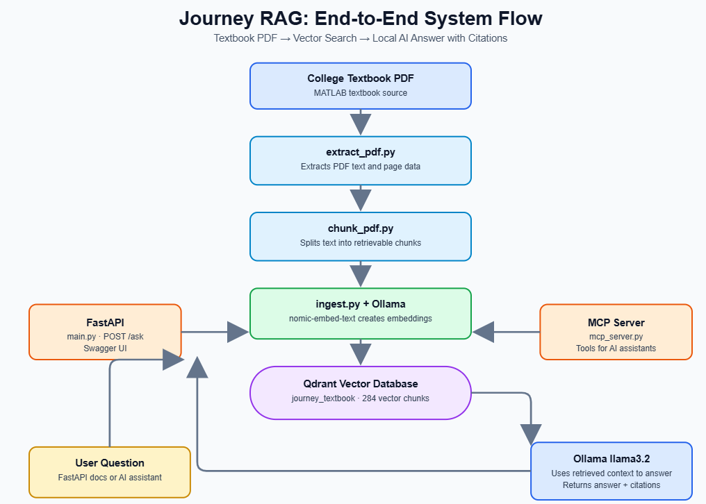

### Qdrant running in Docker

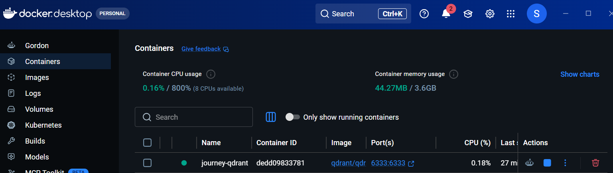

### FastAPI RAG question and cited answer

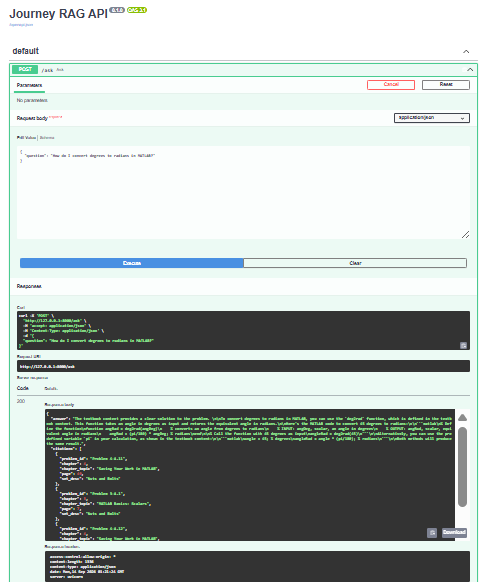

### Local Ollama models

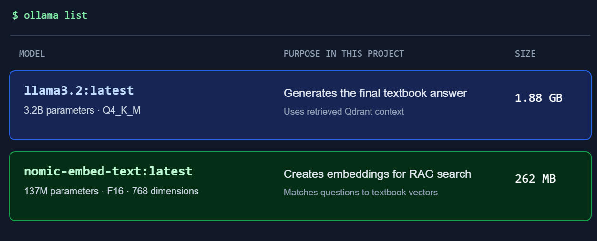

### MCP server implementation

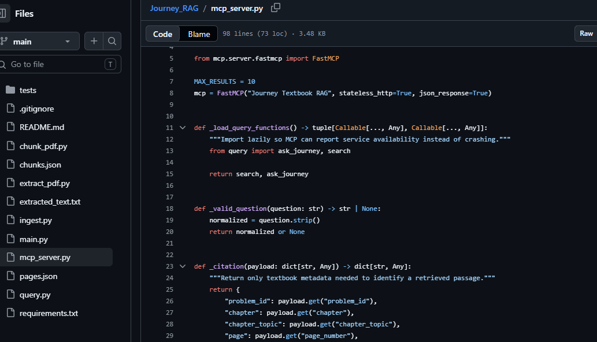
