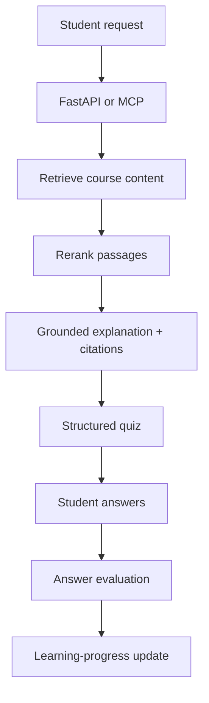

# Journey RAG — Next-Phase Implementation Plan

## Purpose

Extend the existing local RAG prototype into an adaptive-learning workflow without overstating unbuilt capabilities. The current repository already supports PDF ingestion, Qdrant vector retrieval, Ollama generation, FastAPI, and a read-only MCP interface.

## Target student workflow

When a student asks, “Explain gradient descent and test my understanding,” the target flow is:

```text
Student request
  -> Retrieve relevant course content
  -> Rerank the retrieved passages
  -> Generate a grounded explanation with citations
  -> Generate a short quiz in a structured format
  -> Evaluate submitted answers against a rubric
  -> Store an auditable learning-progress update
```



## Delivery plan

### Phase 0 — Baseline and safeguards

- Preserve the current PDF ingestion and `journey_textbook` Qdrant collection.
- Add a versioned evaluation set of retrieval questions, expected source passages, quiz cases, and evaluation rubrics.
- Define privacy boundaries for student identifiers and progress records before storing learner data.
- Keep all model, vector-store, and connector credentials in environment variables; never commit secrets.

**Done when:** baseline retrieval quality, grounded-answer behavior, latency, and failure cases are recorded.

### Phase 1 — Grounded learning interaction

- Add a typed `LearningRequest` containing topic, learning goal, and optional student/session identifier.
- Retrieve relevant chunks from Qdrant using the existing embedding pipeline.
- Add a reranking interface. Begin with a benchmarkable local option and adopt a cross-encoder only when it improves the evaluation set.
- Return a structured payload containing `explanation`, `citations`, `quiz`, and `next_action`.
- Extend MCP with read-only learning tools such as `explain_topic` and `create_quiz`.

**Done when:** a request can produce a cited explanation and a valid quiz payload, with schema and regression tests.

### Phase 2 — Quiz evaluation and learner progress

- Define quiz item types, answer schemas, grading rubrics, and a confidence/needs-review state.
- Add an endpoint for submitted quiz answers.
- Store the minimum necessary progress record: topic, attempt time, score, misconception tags, and recommended review topic.
- Keep progress storage separate from source documents and make it deletable/exportable before using real student data.
- Add conditional routing: reteach when mastery is low, give a harder follow-up when mastery is high, and request clarification when evidence is insufficient.

**Done when:** a complete explain → quiz → submit → evaluate → progress cycle works locally with test data.

### Phase 3 — Retrieval quality and controlled parallel work

- Compare dense vector retrieval against hybrid retrieval (BM25 plus vector search) on the versioned evaluation set.
- Use score fusion only when it improves measured retrieval quality.
- Add a BGE cross-encoder reranker only if it materially improves final ranking quality within an acceptable latency budget.
- Run independent tasks in parallel only when safe, such as citation formatting and quiz-schema validation; preserve deterministic output assembly.
- Add request timeouts, bounded retries, tool-call limits, and trace identifiers.

**Done when:** advanced retrieval or parallelism has a recorded evaluation benefit and regression coverage.

### Phase 4 — Microsoft 365 course-material connector

- Register a Microsoft Entra application and use OAuth 2.0 through MSAL.
- Use least-privilege Microsoft Graph permissions approved by the course-material owner.
- Read authorized SharePoint and OneDrive files through a connector that records source URL, owner/site, modified time, and access scope.
- Send downloaded content into the existing parsing, chunking, and ingestion contract; do not bypass provenance metadata.
- Support incremental ingestion based on document modification data and keep connector tokens outside source control.

**Done when:** an authorized sample SharePoint or OneDrive document can be ingested locally with provenance, access controls, and tests.

### Phase 5 — Operations and evaluation

- Add request traces and evaluation records; introduce Langfuse only after reviewing hosting, privacy, and data-retention requirements.
- Evaluate groundedness, citation correctness, quiz validity, grading agreement, learner-progress behavior, latency, and connector failures.
- Add deployment documentation only after a reproducible local workflow is verified.

**Done when:** the system has repeatable tests and a documented privacy/security review for the chosen deployment.

## Proposed source architecture

```text
Authorized sources
  ├─ Local files
  └─ SharePoint / OneDrive via Microsoft Graph
          -> Parsing and provenance capture
          -> Chunking and embeddings
          -> Qdrant vector retrieval
          -> Optional BM25 retrieval and score fusion
          -> Optional evaluated reranker
          -> Grounded response, quiz, and citations
          -> Learner-progress update
```

Azure Blob, Prefect, Docling/Unstructured, Milvus, Azure OpenAI, and Langfuse are possible future choices, not committed dependencies. Each requires a separate decision based on a concrete need, operating cost, privacy constraints, and measured value.

## Open decisions before implementation

1. What student-data policy and consent process apply to learner progress?
2. Which local or hosted data store should hold progress records?
3. Which Microsoft 365 tenant, site, and least-privilege Graph permissions are approved?
4. Should the connector use delegated user access or an application identity?
5. What evaluation thresholds justify hybrid retrieval or reranking?
6. Which model/provider is approved for grading and learner-facing generation?

## Recommended starting point

Start with Phases 0 and 1 using only local, synthetic learner data. This validates the learning interaction before introducing real student data, cloud costs, Microsoft 365 authorization, or additional infrastructure.
