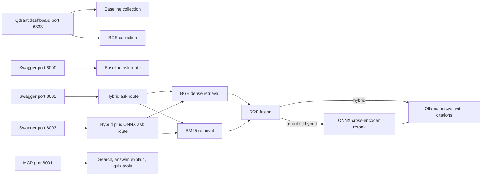

# Local runtime plan

## Verified laptop runtime

| Component | Status | Local configuration |
| --- | --- | --- |
| Docker Qdrant | Complete | `journey-qdrant`, port `6333`. |
| Baseline collection | Complete | `journey_textbook`. |
| BGE collection | Complete | `journey_textbook_bge_v1`, 284 points, 384 dimensions. |
| Baseline API | Complete | FastAPI at `http://127.0.0.1:8000/docs`. |
| Hybrid API | Complete | FastAPI at `http://127.0.0.1:8002/docs` when `JOURNEY_RETRIEVAL_MODE=hybrid`. |
| Hybrid + ONNX reranking API | Complete | FastAPI at `http://127.0.0.1:8003/docs` when hybrid mode and `JOURNEY_ONNX_RERANKER_DIR` are set. |
| MCP server | Complete | Streamable HTTP at `http://127.0.0.1:8001/mcp`. |
| Embedding model | Complete | Ollama `nomic-embed-text` for baseline; BGE small for hybrid dense retrieval. |
| Answer model | Complete | Ollama `llama3.2` in the current application code. |
| ONNX reranker | Complete locally | Exported local model loaded with ONNX Runtime and used by the port `8003` API. The model directory remains ignored by Git. |
| Qwen models | Available locally | Not selected by application code or benchmarked. |

## Demonstration flow

The baseline and hybrid APIs use different ports so they can be compared without
stopping either process. Hybrid mode preserves the original collection and uses
the separate BGE collection.

## Screenshot checklist

1. Open Qdrant at `http://127.0.0.1:6333/dashboard` and show both collections.
2. Open baseline Swagger at `http://127.0.0.1:8000/docs` and run `/ask`.
3. Open hybrid Swagger at `http://127.0.0.1:8002/docs` and run `/ask`.
4. Open reranked hybrid Swagger at `http://127.0.0.1:8003/docs` and run `/ask`.
5. Run local quiz-session creation and submission from Swagger to show the
   deterministic `reteach`, `practice`, or `advance` result.
6. Open GitHub README and `docs/retrieval-experiments.md` for code and flow
   screenshots.

## Target, not built yet

Fine-tuning, LoRA/QLoRA, Axolotl/LLaMA-Factory, LangGraph, vLLM, SGLang,
llama.cpp, FAISS/Milvus/pgvector benchmarking, MLflow, DeepEval, and Microsoft
365 ingestion require independent runtime, data, and evaluation work. They are
not part of the verified local workflow above.
