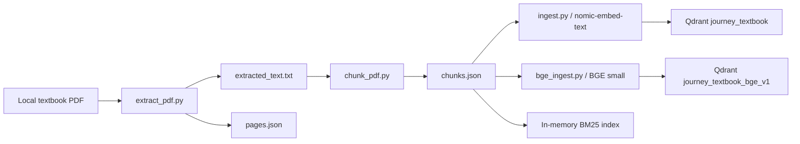
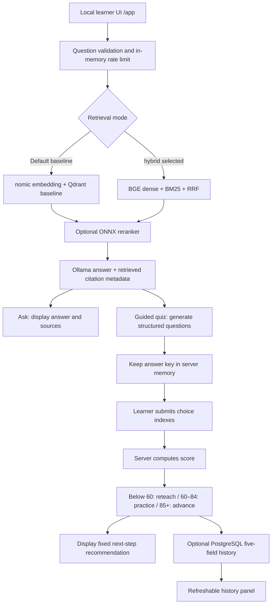

# Journey RAG workflow audit

Audit date: September 30, 2026. This map describes inspected code, including
the local PostgreSQL feature changes that have not yet been committed.

## Corpus preparation

`chunk_pdf.py` consumes the page-marked text file, not `pages.json`.
Generated corpus files exist; the hard-coded source PDF is absent, so fresh
extraction cannot currently run. The BGE path preserves the baseline collection.

## Learner workflow

- `/ask` returns an answer and citations; it does not create a quiz.
- `/learning-sessions` creates the guided quiz; its first valid submission freezes
  the result. Failed database saves can be retried while the session remains alive.
- `/learn` returns an explanation and quiz without creating a scored session.
- `/local-quiz-sessions` is a synthetic demo and never writes progress history.
- MCP is a separate read-only service, not a required stage in the browser flow.
- Routes return recommendations; automatic next-lesson selection or execution is
  not implemented. Citation guards validate metadata presence, not every factual
  assertion or whether the generated answer uses inline references.
- Persistent fields are topic label, score, route, recommendation, and UTC time.
  History is shared locally; individual learner identities are not tracked.

## Current status versus plan

| Stage | Evidence and current limitation |
| --- | --- |
| Corpus | Generated files exist; original PDF absent. |
| Ollama | Responding; llama3.2 and nomic-embed-text installed. |
| Qdrant | Running on 6333; baseline `journey_textbook` verified with 284 points. |
| Hybrid retrieval | Code connected behind environment switch; not live-verified here. |
| ONNX reranker | Expected model export absent; optional stage unavailable. |
| FastAPI and UI | Running on 8003; answer and history panel verified in the browser. |
| Quiz scoring | Real three-question generation and submission succeeded. JSON-schema generation plus one validation retry handles malformed model output. |
| PostgreSQL | Running on 5435; real result persisted and remained after an API restart. |
| MCP | Code and tests exist; port 8001 currently unavailable. |
| Tests | 48 passed with real PostgreSQL integration enabled. |
| Git | Latest commit a6a1793; progress feature staged, not committed or pushed at audit time. |

## Remaining verification sequence

1. Build and evaluate the separate BGE collection before claiming hybrid quality.
2. Enable ONNX only after a compatible export exists and evaluation confirms it.
3. Start and verify MCP separately when its runtime demonstration is needed.
4. Commit completed tested work; push only after explicit approval.

The baseline question-to-history workflow is working end to end. Hybrid retrieval,
ONNX reranking, and MCP remain separate optional runtime checks.

## Generic multi-book workflow

This path accepts searchable PDF, TXT, and Markdown sources. It does not depend
on MATLAB problem headings. The original collection remains intact, repeated
ingestion replaces only the matching source, and the running API sees newly
ingested books without a restart.
