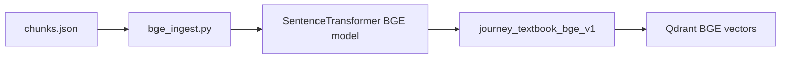
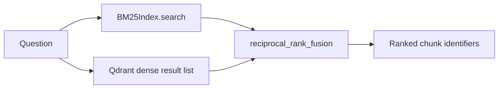
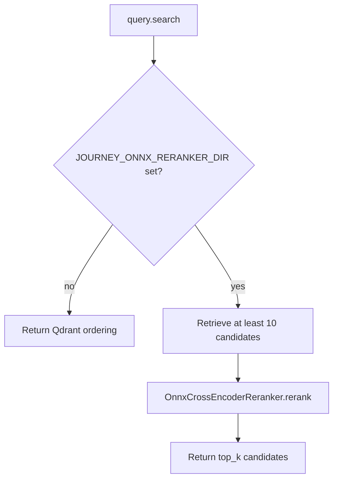
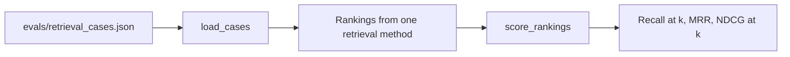

# Retrieval experiments

## BGE collection build

**Versioning**: `bge_ingest.py` refuses to overwrite
`journey_textbook_bge_v1`. This prevents the BGE experiment from changing the
baseline `journey_textbook` collection.

**Model download**: `SentenceTransformer` resolves `BAAI/bge-small-en-v1.5` at
runtime. The model is not part of the repository.

## Hybrid ranking utilities

**Status**: **Partial**. `BM25Index` and `reciprocal_rank_fusion` are tested
utilities. `query.py` does not currently call them, so the default `/ask` path
remains Qdrant-only.

## ONNX reranking

**Fallback**: an unset environment variable skips reranking. A configured path
must contain `model.onnx` or `onnx/model.onnx`; otherwise construction raises a
file error. The adapter uses the CPU execution provider.

## Offline evaluation

**Rules**: use the same labeled cases and `k` across comparisons. The included
file is only a three-case seed set. It is not sufficient to establish a quality
claim by itself.
